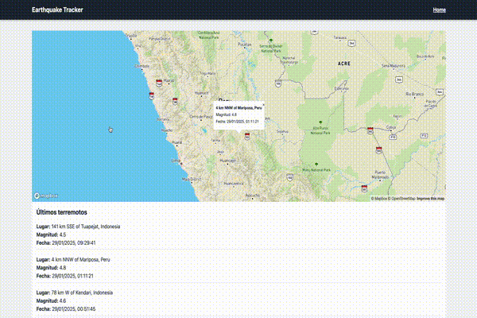

# 📌 Monitoreo de Terremotos

Este proyecto es una aplicación web que permite visualizar terremotos en un mapa interactivo utilizando Mapbox.
Muestra una lista de los últimos terremotos registrados y permite seleccionar cada uno para ver su ubicación exacta en el mapa.

## 📷 Captura de pantalla:



## 🚀 Tecnologías utilizadas:

- Vue.js 3 + Vite
- Tailwind CSS
- Mapbox GL JS
- API de terremotos de USGS

## 📦 Instalación:

Para instalar las dependencias, ejecuta:

```bash
npm install
```

## 🔧 Configuración del entorno:

1. Crea un archivo `.env` en la raíz del proyecto y agrega tu clave de API de Mapbox:

```bash
echo 'VITE_MAPBOX_API_KEY=tu_clave_de_api_aquí' > .env
```

## 🏃‍♂️ Ejecución en desarrollo:

Para ejecutar el proyecto en modo desarrollo, usa:

```bash
npm run dev
```

## 🛠️ Construcción para producción:

Para generar los archivos de producción, ejecuta:

```bash
npm run build
```

## 🌎 Despliegue:

Puedes desplegar la aplicación en Vercel, Netlify o cualquier servicio de hosting estático.
Si usas Vercel, simplemente ejecuta:

```bash
vercel
```

## 📌 Uso de la aplicación:

1. Al abrir la aplicación, verás un mapa en la parte superior con pines que representan terremotos recientes.
2. En la parte inferior, verás una lista de terremotos ordenados por fecha.
3. Al hacer clic en un terremoto de la lista, el mapa hará zoom en su ubicación y mostrará detalles en un popup.
4. El diseño es responsivo y se adapta a diferentes tamaños de pantalla.

## 🎯 Posibles mejoras futuras:

- Filtros avanzados para buscar terremotos por magnitud, fecha o ubicación.
- Soporte para diferentes estilos de mapas en Mapbox.
- Notificaciones en tiempo real para nuevos terremotos.
- Modo oscuro para mejorar la accesibilidad.

## 📝 Licencia:

Este proyecto está bajo la licencia MIT. ¡Puedes contribuir y mejorar la aplicación!

## 💬 Comentarios y soporte:

Para cualquier consulta o mejora, abre un issue en el repositorio o contáctame.
